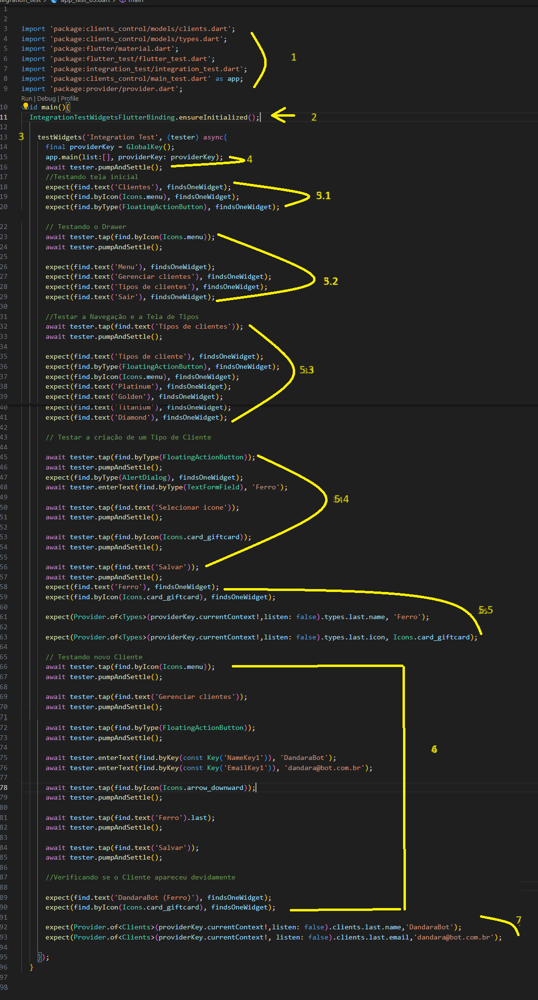

# Aplicando Testes Integracao de widgets

Este projeto é fruto do curso de 'Flutter : implementação de testes de integração da plataforma ALURA

## introdução

Dado um determinado projeto, já estando esse funcional ou seja, com algumas funcionalidades como de cadastro e remoção funcionando, a ideia é fazer testes de integração com ele.

<table style="width: 100%; border-collapse: collapse;" border="0">
  <tr>
    <td style="border: none; width: 10%;"> </td>
    <td style="border: none; width: 10%;"> </td>
    <td style="border: none; width: 10%;"> </td>
    <td style="border: none; width: 10%;"> </td>
    <td style="border: none; width: 10%;"> </td>
    <td style="border: none; width: 10%;"> </td>
    <td style="border: none; width: 10%;"> </td>
  </tr>
</table>

## Primeiro teste de integração

 Este teste foi feito para simular interações do usuário com a interface do aplicativo e verificar se o comportamento esperado ocorre.  

  

  obs: O teste é realizado diretamente no emulador e para que fosse possivel acompanhar cada etapa foi colocado o comando "await Future.delayed(Duration(seconds: 10));".

  ### Inicialização do Teste:

IntegrationTestWidgetsFlutterBinding.ensureInitialized(): Garante que o ambiente de teste de widgets está inicializado para testes de integração.

### Definição do Teste:

testWidgets('integration test', (tester) async {...}): Define um teste de widget chamado 'integration test'. O tester é um objeto que permite interagir com a interface do usuário e o ambiente de teste durante a execução do teste.

### Execução do Aplicativo:

app.main();: Inicia o aplicativo. Isso é necessário para que o teste possa interagir com a interface do usuário do aplicativo.

### Espera a Estabilização da Interface:

await tester.pumpAndSettle();: Bombeia eventos de quadros para construir a interface do usuário e espera até que a animação termine e a interface do usuário esteja estável.

## Verificação Inicial:

expect(find.text('Menu'), findsNothing);: Verifica se não existe um widget com o texto 'Menu' na tela. Isso é feito antes de qualquer interação para assegurar que o estado inicial está conforme esperado.

### Interação com a Interface:

await Future.delayed(Duration(seconds: 10));: Espera por 10 segundos. 
await tester.tap(find.byIcon(Icons.menu));: Simula uma interação do usuário, tocando no ícone do menu.

### Espera e Verificação Final:

Após a espera de 10 segundos, await tester.pumpAndSettle(); é chamado novamente para garantir que todas as animações e atualizações de estado tenham sido concluídas após a interação. 

expect(find.text('Menu'), findsOneWidget);: Verifica se agora existe exatamente um widget com o texto 'Menu' na tela, indicando que a interação anterior teve o efeito esperado.

### Conclusão:

O teste termina com outra espera de 10 segundos. Isso pode ser usado para observar o estado final do aplicativo ou esperar por eventos assíncronos que possam levar algum tempo para serem concluídos.
Este teste de integração simula a abertura de um menu no aplicativo e verifica se o texto 'Menu' é exibido na tela após a interação, garantindo que a interface do usuário responda conforme esperado às ações do usuário.

## Analise dos proximos testes

### O que será necessário
 
- Tela inicial (tela de clientes)
- Verificar se o drawer está completo
- Testar a navegação
- Verificar a tela "Tipos de clientes"
- Criar um novo tipo de cliente
- Criar um novo cliente com o novo tipo

 Contibuando a utilizar o pacote integration_test junto com flutter_test, foi desenvolvido um teste para nosso gerenciador de clientes 

  

  Analisando o codigo acima teremos os seguintes comportamentos:

### 1 - Importações: 

   O código começa importando os pacotes necessários para o teste, incluindo os modelos de dados (clients.dart e types.dart), widgets do Flutter (material.dart), 
   funcionalidades de teste (flutter_test.dart), testes de integração (integration_test.dart), a aplicação principal para teste (main_test.dart como app) 
   e o gerenciamento de estado (provider.dart).

### 2 - Função main(): 

    Define o ponto de entrada para os testes de integração. Dentro dela, IntegrationTestWidgetsFlutterBinding.ensureInitialized() 
    é chamado para inicializar o binding específico para testes de integração.

### 3 - testWidgets: 

   Define um teste de widget dentro do contexto de testes de integração. O teste é nomeado 'Integration Test' e recebe um widget tester 
   como argumento, que permite simular interações do usuário e inspecionar o estado da UI.

### 4 - Inicialização do App: 

  O teste começa executando a função main do aplicativo (app.main) com argumentos específicos para o teste, preparando o ambiente.

### 5 - Testes de UI: 

 O código procede com uma série de verificações e interações na UI:

  5.1 Verifica se elementos específicos estão presentes na tela inicial, 
      como o texto 'Clientes', um ícone de menu e um FloatingActionButton.

  5.2 Simula a abertura de um menu (Drawer) e verifica a presença de itens específicos como 
      'Menu', 'Gerenciar clientes', 'Tipos de clientes' e 'Sair'.

  5.3 Navega para a tela de 'Tipos de clientes', verifica a presença de tipos 
      de clientes específicos e o botão para adicionar novos tipos.

  5.4 Simula a adição de um novo tipo de cliente ('Ferro') e verifica 
      se o tipo foi adicionado corretamente.

  5.5 Verifica se o novo tipo de cliente foi salvo corretamente no provedor 
      de estado (Provider), verificando o nome e o ícone.

### 4 - Teste de Adição de Novo Cliente: 

 O código simula a adição de um novo cliente ('DandaraBot') com detalhes específicos e verifica se o cliente foi adicionado corretamente, tanto na UI quanto no provedor de estado.

### 5 - Verificações Finais: 

 Após adicionar o novo cliente, o teste verifica se os detalhes do cliente aparecem corretamente na UI e se os dados foram salvos corretamente no provedor de estado.

### 7- Conclusão

   Este teste de integração cobre várias funcionalidades do aplicativo, incluindo a navegação entre telas, a interação com elementos da UI como botões e formulários, e a verificação de que o estado da aplicação é atualizado corretamente após essas interações. É uma forma eficaz de garantir que o fluxo de usuário principal do aplicativo funciona como esperado.

### 8 - Observações finais

   Para realizar o teste de dados em provider foi necessário adicionar uma parametro de uma "key" na função main que por sintaxe sempre 
   será necessário ser precedido um array

   Outro ponto foi que por conta propria, resolvi criar uma copia do arquivo "main.dart" no qual chamei de "main_test.dart" para realizar tal teste

